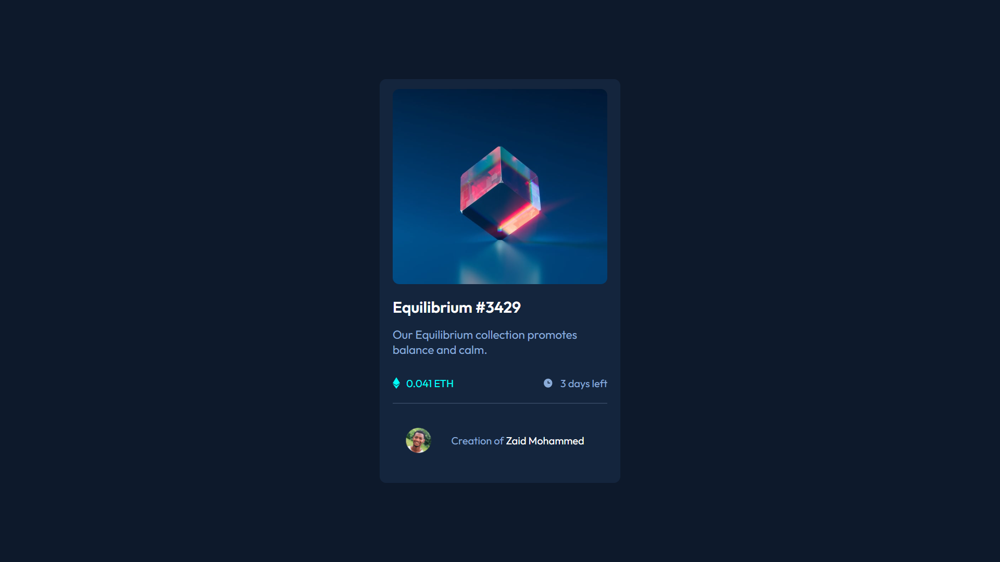

# Frontend Mentor - NFT preview card component solution

This is a solution to the [NFT preview card component challenge on Frontend Mentor](https://www.frontendmentor.io/challenges/nft-preview-card-component-SbdUL_w0U). Frontend Mentor challenges help you improve your coding skills by building realistic projects.

## Table of contents

- [Overview](#overview)
  - [The challenge](#the-challenge)
  - [Screenshot](#screenshot)
  - [Links](#links)
- [My process](#my-process)
  - [Built with](#built-with)
  - [What I learned](#what-i-learned)
- [Author](#author)

## Overview

### The challenge

Users should be able to:

- View the optimal layout depending on their device's screen size
- See hover states for interactive elements

### Screenshot



### Links

- Solution URL: [https://www.frontendmentor.io/solutions/nft-card-component-using-html-and-css-MrhC4v28Mm](https://www.frontendmentor.io/solutions/nft-card-component-using-html-and-css-MrhC4v28Mm)
- Live Site URL: [https://nft-card-component-blue.vercel.app/](https://nft-card-component-blue.vercel.app/)

## My process

### Built with

- Semantic HTML5 markup
- CSS custom properties
- Flexbox
- CSS Grid
- Mobile-first workflow

### What I learned

```html
<h1>Some HTML code I'm proud of</h1>
```

```css
.proud-of-this-css {
  color: papayawhip;
}
```

## Author

- Website - [Zaid Mohammed](https://iamzaidmohammed.github.io)
- Frontend Mentor - [@zaidmohammed7](https://www.frontendmentor.io/profile/zaidmohammed7)
- Twitter - [@iamzaidmohammed](https://www.twitter.com/iamzaidmohammed)
